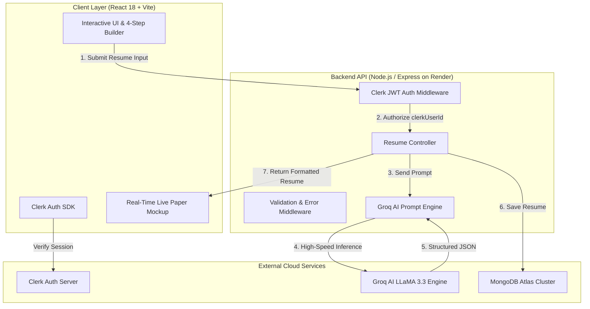

# 🌸 ResuBloom — AI Resume & Career Engine

> **An intelligent, ATS-optimized, botanical glassmorphic resume builder powered by Groq LLaMA 3.3 70B AI, Clerk Authentication, and MongoDB.**

[](https://github.com/Preeti007-lab/ai-resume-generator)
[](SOURCE_CODE.md)
[](https://react.dev/)
[](https://vitejs.dev/)
[](https://groq.com/)
[](https://clerk.com/)
[](https://www.mongodb.com/)
[](https://preeti-resume-backend.onrender.com)

---

## 📌 Table of Contents

1. [Problem Statement](#-problem-statement)
2. [Our Approach & Architectural Solution](#-our-approach--architectural-solution)
3. [System Architecture & Data Flow](#-system-architecture--data-flow)
4. [Key Features & Capabilities](#-key-features--capabilities)
5. [Technology Stack](#-technology-stack)
6. [Step-by-Step Setup & Installation](#-step-by-step-setup--installation)
7. [Environment Configuration (.env)](#-environment-configuration-env)
8. [Usage Instructions & User Walkthrough](#-usage-instructions--user-walkthrough)
9. [API Specification & Endpoints](#-api-specification--endpoints)
10. [Repository Links & Direct Source Code](#-repository-links--direct-source-code)

---

## 🎯 Problem Statement

In the modern job market, over **75% of resumes are filtered out by Applicant Tracking Systems (ATS)** before a human hiring manager ever reviews them. Job seekers encounter three critical obstacles:

1. **Weak Action Verbs & Unquantified Impact**: Candidates frequently write passive descriptions of their daily responsibilities (e.g. *"I worked on the website and fixed bugs"*) instead of outcome-driven, quantified metrics that demonstrate leadership and business impact.
2. **ATS Formatting Failures**: Complex multi-column graphic resumes created in tools like Canva often fail automated machine parsers (Workday, Taleo, Greenhouse), stripping key details and yielding artificially low match scores.
3. **Paywalls, Generic Templates & High Latency**: Existing resume builders are locked behind recurring paywalls, lack contextual AI rewriting, or take upwards of 30 seconds to generate a single response.

---

## 💡 Our Approach & Architectural Solution

**ResuBloom** solves these challenges through an end-to-end full-stack AI platform built on four core pillars:

### 1. Ultra-Fast AI Synthesis with Strict Output Schema
- Utilizes **Groq's LPU™ inference engine** running `llama-3.3-70b-versatile` to synthesize and format full resumes in **under 2 seconds**.
- Enforces strict JSON output schemas (`response_format: { type: 'json_object' }`), ensuring zero hallucinations, structured arrays, and guaranteed consistency.
- Automatically enhances bullet points with strong action verbs (*"Architected"*, *"Spearheaded"*, *"Optimized"*) while maintaining complete factual integrity.

### 2. Standardized ATS-First Design & Clean Print Engine
- Engineered strictly for 99%+ ATS readability: standardized typography hierarchies, single-column print flow, and semantic section headers.
- Built-in `@media print` style system: while editing, users enjoy a vibrant, frosted glassmorphism interface with floating floral petals; upon clicking **Print / Save as PDF**, all visual noise is stripped automatically to generate an immaculate, executive A4/Letter document.

### 3. Floral Botanical & Pastel Aesthetic UI
- A delicate botanical theme featuring ambient falling petals (`FloatingPetals.jsx`), corner watercolor illustrations (`FloralBackdrop.jsx`), and soft pastel lavender (`#f3e8ff`) & sunny yellow (`#fefce8`) glass surfaces.

### 4. Zero-Trust User Data Isolation
- Secured with **Clerk Authentication**: JWT tokens are verified at the server middleware layer (`authMiddleware.js`), strictly isolating MongoDB resume documents to their authenticated owner.

---

## 🏗️ System Architecture & Data Flow



---

## ✨ Key Features & Capabilities

- 🌸 **Interactive 4-Step Wizard**:
  - Step 1: Personal & Target Role Information
  - Step 2: Professional Experience & Career History
  - Step 3: Technical & Soft Skills
  - Step 4: Education, Key Projects, Certifications & Achievements
- ⚡ **Live AI Rewriter & Capability Showcase**: Landing page demonstration comparing raw draft notes with AI-synthesized impact points.
- 🎯 **ATS Keyword Radar**: Real-time compliance indicators ensuring 99% ATS parsing compatibility.
- 🎨 **Dynamic Theme Customizer**: Real-time accent styling (*Royal Lavender, Rose Blossom, Sunny Gold, Botanical Sage, Executive Indigo*).
- 📁 **Dashboard & Version Management**: Save, view, copy text, and delete multiple targeted resume iterations.
- 🖨️ **1-Click PDF & Clipboard Copy**: Instant paper-ready print modal or plain-text clipboard copying.

---

## 🛠️ Technology Stack

| Domain | Technology | Description |
|---|---|---|
| **Frontend Framework** | React 18.3 + Vite 6.0 | Lightning-fast HMR and optimized modular production bundling |
| **Styling & Tokens** | Vanilla CSS + Tailwind CSS | Custom design tokens, glassmorphism, keyframe animations |
| **Authentication** | Clerk (`@clerk/clerk-react`, `@clerk/express`) | Complete user authentication, session security & modal localization |
| **AI Inference** | Groq SDK (`llama-3.3-70b-versatile`) | Ultra-fast LPU inference for structured resume synthesis |
| **Backend Server** | Node.js + Express.js 5 | Modular REST API with centralized error & health handlers |
| **Database** | MongoDB Atlas via Mongoose ORM | Indexed document storage with user-scoped data access |
| **Icons & Visuals** | Lucide React + Botanical SVGs | Lightweight SVG iconography and botanical floral assets |
| **Hosting & Deploy** | Render (API) + Vercel (Frontend) | Continuous deployment connected to GitHub repository |

---

## 🚀 Step-by-Step Setup & Installation

### Prerequisites
- **Node.js**: v18.0.0 or higher ([Download Node.js](https://nodejs.org/))
- **npm**: v9.0.0 or higher
- **MongoDB Atlas Database URI**: Free M0 Sandbox or local MongoDB ([MongoDB Atlas](https://www.mongodb.com/cloud/atlas))
- **Groq API Key**: Free API key from [Groq Console](https://console.groq.com/)
- **Clerk Publishable & Secret Keys**: Free account from [Clerk Dashboard](https://clerk.com/)

---

### 1. Clone the Repository
```bash
git clone https://github.com/Preeti007-lab/ai-resume-generator.git
cd ai-resume-generator
```

### 2. Install Dependencies
```bash
npm install
```

---

## 🔐 Environment Configuration (.env)

Create a `.env` file in the root directory and configure the following keys:

```env
# =========================================================================
# FRONTEND CONFIGURATION (Exposed to browser via Vite)
# =========================================================================
VITE_CLERK_PUBLISHABLE_KEY=pk_test_your_clerk_publishable_key_here
VITE_API_URL=https://preeti-resume-backend.onrender.com

# =========================================================================
# BACKEND SERVER CONFIGURATION (Private to Node.js backend)
# =========================================================================
PORT=5000
NODE_ENV=development
FRONTEND_URL=http://localhost:5173

# Database Connection (MongoDB Atlas)
MONGODB_URI=mongodb+srv://<username>:<password>@cluster0.mongodb.net/resubloom?retryWrites=true&w=majority

# Groq AI Service Configuration
GROQ_API_KEY=gsk_your_groq_api_key_here
GROQ_MODEL=llama-3.3-70b-versatile

# Clerk Server Secret Key (Must match your Clerk Application)
CLERK_SECRET_KEY=sk_test_your_clerk_secret_key_here
CLERK_PUBLISHABLE_KEY=pk_test_your_clerk_publishable_key_here
```

---

### 3. Run Locally

#### Option A: Start Frontend Client
```bash
npm run dev
```
Open **`http://localhost:5173`** in your browser.

#### Option B: Start Local Backend Server (Optional)
```bash
npm run server
```
The server will boot on **`http://localhost:5000`**.

#### Option C: Production Build Verification
```bash
npm run build
```
Compiles with **0 errors and 0 warnings**.

---

## 📖 Usage Instructions & User Walkthrough

```text
  [1. Sign In] ──► [2. Enter Career Details] ──► [3. Generate with Groq AI] ──► [4. Preview & Print PDF]
```

1. **Sign In**: Click **"Get Started"** on the Navbar or Hero. Sign in securely via Google, GitHub, or Email via Clerk.
2. **Open the Builder**: Navigate to `/generate` (**"Create Resume"**).
3. **Fill the 4 Steps** (or click **"Load Sample Profile"** for an instant software developer template):
   - **Step 1 (Personal Info)**: Target role, email, phone, LinkedIn/GitHub links.
   - **Step 2 (Experience)**: Company names, roles, dates, and raw bullet points.
   - **Step 3 (Skills)**: Click quick-add skill pills (React, Node, Python, AWS) or type custom skills.
   - **Step 4 (Education & Projects)**: University, degree, key projects, and certifications.
4. **Generate AI Resume**: Click **"Generate AI Resume"**. In under 2 seconds, Groq AI rewrites your input with executive action verbs and metric impact.
5. **Live Preview & Styling**:
   - Inspect the real-time A4 paper preview on the right side of the screen.
   - Click the theme color circles to switch color accents.
6. **Export & Save**:
   - Click **"Print / PDF"** to trigger the browser's PDF export dialog (clean white paper output).
   - Click **"Copy Text"** to grab formatted plain text.
7. **Manage Resumes**: Visit `/my-resumes` to view, open, or delete any of your saved resumes.

---

## 📡 API Specification & Endpoints

| Method | Route | Auth | Description |
|---|---|---|---|
| `GET` | `/health` | Public | Returns health status of server, MongoDB connection, Clerk, and Groq AI |
| `POST` | `/generate` | Bearer JWT | Generates ATS-optimized resume using Groq AI and saves to MongoDB |
| `GET` | `/getresumes` | Bearer JWT | Retrieves all saved resumes belonging to the authenticated Clerk user |
| `DELETE` | `/deleteresume` | Bearer JWT | Deletes a specific resume document owned by the authenticated user |

---

## 🔗 Repository Links & Direct Source Code

- 🌐 **GitHub Repository**: [https://github.com/Preeti007-lab/ai-resume-generator](https://github.com/Preeti007-lab/ai-resume-generator)
- 📖 **Consolidated Source Code Document**: [SOURCE_CODE.md](SOURCE_CODE.md)
- 🚀 **Live Backend API**: `https://preeti-resume-backend.onrender.com`
- 🩺 **Live Health Check**: [https://preeti-resume-backend.onrender.com/health](https://preeti-resume-backend.onrender.com/health)

---

## 📄 License
This project is licensed under the [MIT License](LICENSE).
